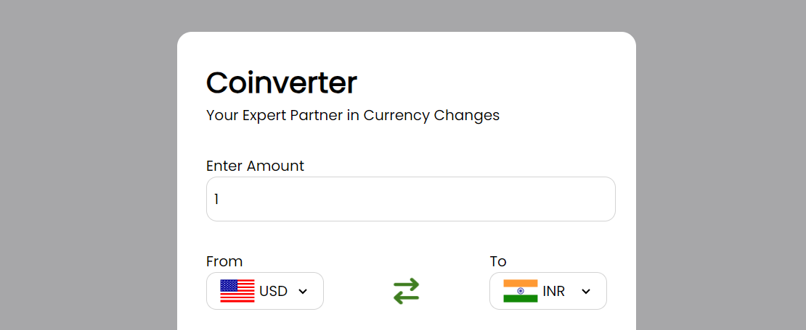

# Coinverter 💱 - Your Expert Partner in Currency Changes

<em>&nbsp; (Tap on these coins to view the project)</em>

 

# Overview
Welcome to <strong>Coinverter</strong> – a cutting-edge currency converter web app. This project marks my yet another foray into API integration, unlocking the power of real-time exchange rates for seamless currency conversions. Through this project, I gained valuable insights into API usage, promising a dynamic and accurate tool for users.

 

# Technologies Used

  

 

# Features
This project has the following features:

<ul>
    <li><strong>Real-time Currency Conversion:</strong> External APIs for live exchange rates, featuring flags to represent each currency for a visual and accurate conversion experience.</li>
    <li><strong>Dynamic Content Loading:</strong> Used async functions and 'await' to efficiently fetch and display currency data, ensuring a smooth and responsive user experience.</li>
    <li><strong>Interactive Design:</strong> Enhanced user engagement with an intuitive interface for easy identification and navigation.</li>
    <li><strong>GitHub Repository:</strong> Concluded the project with a link to the project's GitHub repository for further exploration and collaboration.</li>
</ul>

 

# Learnings:

Here are the key learnings from the Coinverter project:

<ul>
    <li><strong>API Integration:</strong> Delved into the world of API integration, leveraging external data sources to dynamically fetch real-time currency exchange rates.</li>
    <li><strong>Asynchronous Programming:</strong> Applied knowledge of promises, async functions, and the 'await' keyword to efficiently handle asynchronous operations when fetching and displaying live currency data.</li>
    <li><strong>JSON File Handling:</strong> Utilized JSON for structured storage and retrieval of currency information, honing skills in managing data within a web project.</li>
    <li><strong>Responsive Design:</strong> Ensured seamless functionality across devices, perfecting the art of responsive design for an optimal user experience in currency conversion.</li>
    <li><strong>HTML and CSS Mastery:</strong> Showcased expertise in HTML and CSS to craft an intuitive and visually appealing interface, enhancing the overall aesthetics of the currency converter web app.</li>
    <li><strong>JavaScript Proficiency:</strong> Strengthened JavaScript skills by implementing dynamic content loading, real-time updates, and user-friendly features, creating an engaging and efficient currency conversion experience.</li>
</ul>

 

# Conclusion

Thanks for exploring Coinverter, where currency conversion meets simplicity! This project dives into the realms of JavaScript, APIs, and dynamic content to deliver a seamless experience. Enjoy the world of real-time currency facts and perhaps pick up a thing or two about the global monetary landscape!

Feel free to dive into the code, contribute, or use it for educational purposes. Your feedback and contributions are immensely valuable.

  

  Exciting things ahead! 🌟🚀

